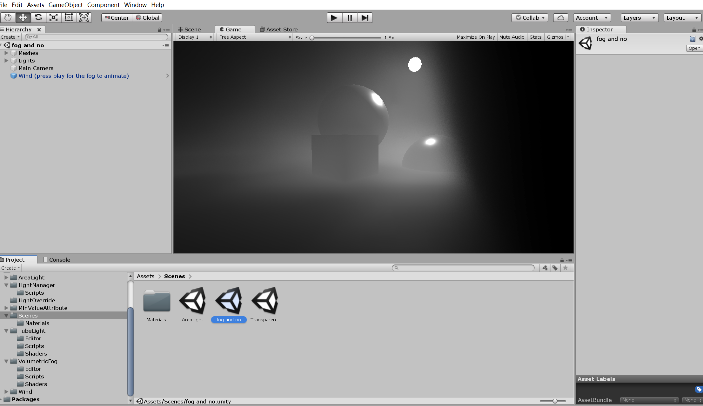

# GodRay-Experiment
图形学实验实现四种体积光QAQ
### Unity版本

| 版本 | 描述            |
|------|---------------|
| Unity 2021.3.36f1 (LTS) | 其他普通实现。       |
| Unity 2018.3.0b5 | 用于光线追踪的测试和开发。 |

### BillBoard贴片
Billboard 贴片实现体积光

### fog-and-wind-ray-marching
使用（Ray Marching）来模拟体积雾并实现风效果脚本。

### Volume Shadow
体积阴影的实现体积光。体积阴影用于在三维空间中生成阴影效果，使得物体可以在体积内投射阴影，

### VolumetricLight-master
实现的最终光影追踪体积光实现

### 径向模糊
径向模糊实现体积光

